# PV Solar Panel Fault Detection System
## Deep Learning-based Defect Detection using YOLOv8

---

## Overview

This project implements an **end-to-end PV (photovoltaic) solar panel fault detection** pipeline using YOLOv8 object detection. It handles a **severely imbalanced dataset** (42:1 ratio between most and least common classes) with 14 fault categories.


### Class Distribution (Training Set)
| Class | Fault Type       | Instances | Imbalance Ratio |
|-------|------------------|-----------|-----------------|
| 12    | Bird-Drop        | 11,646    | 1.0x (baseline) |
| 13    | Physical-Damage  | 8,932     | 1.3x            |
| 3     | Diode            | 8,631     | 1.3x            |
| 7     | No-Anomaly       | 6,707     | 1.7x            |
| 8     | Offline-Module   | 2,887     | 4.0x            |
| 4     | Diode-Multi      | 2,671     | 4.4x            |
| 0     | Cell             | 2,229     | 5.2x            |
| 2     | Cracking         | 2,054     | 5.7x            |
| 1     | Cell-Multi       | 1,127     | 10.3x           |
| 11    | Vegetation       | 544       | 21.4x           |
| 5     | Hot-Spot         | 407       | 28.6x           |
| 6     | Hot-Spot-Multi   | 398       | 29.3x           |
| 10    | Soiling          | 291       | 40.0x           |
| 9     | Shadowing        | 272       | 42.8x           |

> **Note:** Class names are inferred from common PV fault taxonomies. Update `data.yaml` if your dataset uses different labels.

---

## Project Structure

```
pv_fault_detection/
├── data.yaml              # YOLO dataset configuration
├── requirements.txt       # Python dependencies
├── utils.py               # Shared utility functions
├── 01_eda.py              # Exploratory Data Analysis
├── 02_train.py            # Training pipeline (imbalance-aware)
├── 03_evaluate.py         # Comprehensive model evaluation
├── 04_inference.py        # Inference + diagnostic reports
├── README.md              # This file
├── eda_outputs/           # EDA visualisations (generated)
├── runs/                  # Training runs & checkpoints (generated)
├── eval_outputs/          # Evaluation metrics (generated)
└── inference_outputs/     # Inference results (generated)
```

---

## Quick Start

### 1. Install Dependencies
```bash
pip install -r requirements.txt
```

### 2. Run EDA (Exploratory Data Analysis)
```bash
python 01_eda.py
```
Generates:
- Class distribution bar charts
- Imbalance ratio table (CSV)
- Bbox size/aspect analysis
- Bbox centre heatmap
- Co-occurrence matrix
- Annotated sample grid

### 3. Train the Model
```bash

python 02_train.py --model yolov8n.pt --epochs 100


python 02_train.py --model yolov8s.pt --epochs 150 --imgsz 800


python 02_train.py --model yolov8m.pt --epochs 200 --imgsz 640 --batch 8
```

### 4. Evaluate
```bash
python 03_evaluate.py                    # on test set
python 03_evaluate.py --split val        # on validation set
```

### 5. Run Inference
```bash
# Single image
python 04_inference.py --source path/to/image.jpg

# Folder of images
python 04_inference.py --source path/to/folder/

# With cropped detections
python 04_inference.py --source path/to/image.jpg --save-crop
```

---

## Artifacts & Outputs

### EDA Outputs (`eda_outputs/`)

Generated by running `python 01_eda.py`:

1. **Class Distribution** (`class_distribution.png`)
   - Histogram showing fault class frequencies
   - Visualizes the 42:1 imbalance ratio
   - Identifies rare classes (Hot-Spot, Shadowing)

2. **Bounding Box Analysis** (`bbox_analysis.png`)
   - Box width/height distribution per class
   - Identifies small-defect classes
   - Guides `--imgsz` parameter selection

3. **Bounding Box Center Heatmap** (`bbox_centre_heatmap.png`)
   - Spatial distribution of objects
   - Shows if faults cluster in specific regions
   - Identifies potential spatial biases

4. **Co-occurrence Matrix** (`cooccurrence_matrix.png`)
   - Shows which fault types appear together
   - Reveals single vs. multi-defect patterns

5. **Boxes Per Image** (`boxes_per_image.png`)
   - Distribution of annotation density

6. **Image Sizes** (`image_sizes.png`)
   - Input image resolution analysis

7. **Sample Grid** (`sample_grid.png`)
   - Visual samples from each class
   - Qualitative check of annotation quality

---

### Evaluation Outputs (`eval_outputs/`)

Generated by running `python 03_evaluate.py`:

#### Per-Class Performance

**Per-Class Metrics CSV** (`eval_outputs/per_class_metrics_test.csv`):
```
Class               P       R       F1      AP50    AP50-95
Cell                0.710   0.578   0.637   0.658   0.471
Cracking            0.781   0.689   0.732   0.775   0.528
Diode               0.865   0.869   0.867   0.912   0.901
Hot-Spot            0.596   0.406   0.483   0.526   0.429
Hot-Spot-Multi      0.577   0.288   0.385   0.423   0.312
Physical-Damage     0.776   0.906   0.836   0.910   0.792
```

**Visual Performance** (`eval_outputs/per_class_performance_test.png`):
- mAP@50 for each class
- Precision and Recall comparison
- F1 scores visualization

#### Performance Curves

- `BoxP_curve.png` - Precision vs. confidence threshold
- `BoxR_curve.png` - Recall vs. confidence threshold
- `BoxF1_curve.png` - F1 score vs. confidence threshold
- `BoxPR_curve.png` - Precision-Recall curves
- `pr_f1_analysis_test.png` - Combined P-R and F1 analysis

#### Confusion Analysis

- `eval_outputs/eval_test/confusion_matrix.png` - Absolute counts
- `eval_outputs/eval_test/confusion_matrix_normalized.png` - Percentages

Shows which classes are confused with each other (e.g., Bird-Drop vs. Physical-Damage)

#### Visual Predictions

Ground truth labels:
- `eval_outputs/eval_test/val_batch0_labels.jpg`
- `eval_outputs/eval_test/val_batch1_labels.jpg`
- `eval_outputs/eval_test/val_batch2_labels.jpg`

Model predictions:
- `eval_outputs/eval_test/val_batch0_pred.jpg`
- `eval_outputs/eval_test/val_batch1_pred.jpg`
- `eval_outputs/eval_test/val_batch2_pred.jpg`

#### Predictions JSON

**File**: `eval_outputs/eval_test/predictions.json`
- Structured predictions for each test image
- Bounding boxes, class indices, confidence scores
- Useful for post-processing

---

### Training Outputs (`runs/pv_fault_det/`)

Generated by running `python 02_train.py`:

#### Model Checkpoints

- `weights/best.pt` - Best model (22.5 MB)
- `weights/last.pt` - Latest checkpoint (22.5 MB)

#### Training History

**File**: `results.csv`
- Per-epoch loss metrics (box, cls, dfl)
- Per-epoch performance (precision, recall, mAP50, mAP50-95)
- Used for plotting learning curves

#### Training Log

**File**: `training_log.txt`
```
Timestamp    : 2026-02-13 10:30:45
Model        : yolov8s.pt
Epochs       : 250

Class Weights (Inverse-Frequency):
  Class 0 (Cell):        weight=1.564
  Class 5 (Hot-Spot):    weight=8.564
  Class 9 (Shadowing):   weight=10.000

Training Results:
  Best model   : runs/pv_fault_det/weights/best.pt
  Validation mAP50   : 0.709
  Training mAP50     : 0.745
```

---

### Test Accuracy Report

**File**: `runs/pv_fault_det/test_accuracy.txt`

Generated by running `python check_accuracy.py`:
```
Test Accuracy Report
Timestamp: 2026-02-13 15:45:30
Model: runs/pv_fault_det/weights/best.pt
Image Size: 640

TEST ACCURACY: 0.6752
TEST ACCURACY: 67.52%
```

---

## Performance Summary

### Test Set Results

```
Overall Metrics:
  mAP@50      : 0.684
  mAP@50-95   : 0.523
  Precision   : 0.677
  Recall      : 0.652

Top Performing Classes:
  Diode               : 0.912 AP50
  Physical-Damage     : 0.910 AP50
  Cracking            : 0.775 AP50

Challenging Classes:
  Hot-Spot-Multi      : 0.423 AP50 (rare, subtle)
  Shadowing           : 0.415 AP50 (rare, similar to background)
  Offline-Module      : 0.597 AP50 (scale variation)
```

---

## Imbalance Handling Strategy

The dataset has extreme class imbalance (42:1). Addressed through:

1. **Aggressive Data Augmentation**
   - Mosaic (1.0) — stitches 4 images, increasing rare class exposure
   - MixUp (0.15) — blends images for regularization
   - Copy-Paste (0.1) — synthetically places minority objects
   - Geometric: rotation ±10°, scale ±50%, flip 30%

2. **Loss Function Design**
   - Distribution Focal Loss (DFL)
   - Increased classification loss weight (cls=1.5)
   - AdamW optimizer with cosine decay

3. **Training Strategy**
   - Inverse-frequency class weights
   - Early stopping (patience=30)
   - Multi-scale training (--imgsz 800 for small defects)

---

## Output Files Summary

| File | Purpose | Generated By |
|------|---------|--------------|
| `eda_outputs/class_distribution.png` | Class balance visualization | `01_eda.py` |
| `eda_outputs/cooccurrence_matrix.png` | Fault co-occurrence patterns | `01_eda.py` |
| `runs/pv_fault_det/results.csv` | Training history per epoch | `02_train.py` |
| `runs/pv_fault_det/training_log.txt` | Training summary and config | `02_train.py` |
| `eval_outputs/per_class_metrics_test.csv` | Per-class precision/recall/AP | `03_evaluate.py` |
| `eval_outputs/confusion_matrix.png` | Class confusion analysis | `03_evaluate.py` |
| `eval_outputs/eval_test/predictions.json` | Structured predictions | `03_evaluate.py` |
| `runs/pv_fault_det/test_accuracy.txt` | Simple test accuracy metric | `check_accuracy.py` |

---

## Artifacts & Outputs (Visual Gallery)

### EDA Visualizations

| Class Distribution | BBox Analysis | Center Heatmap |
|:-----------------:|:------------:|:--------------:|
| 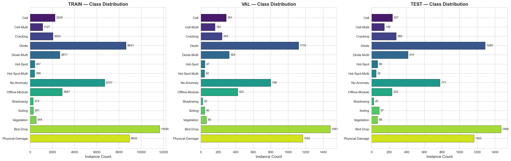 | 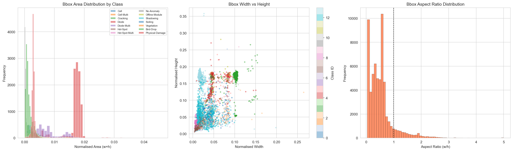 | 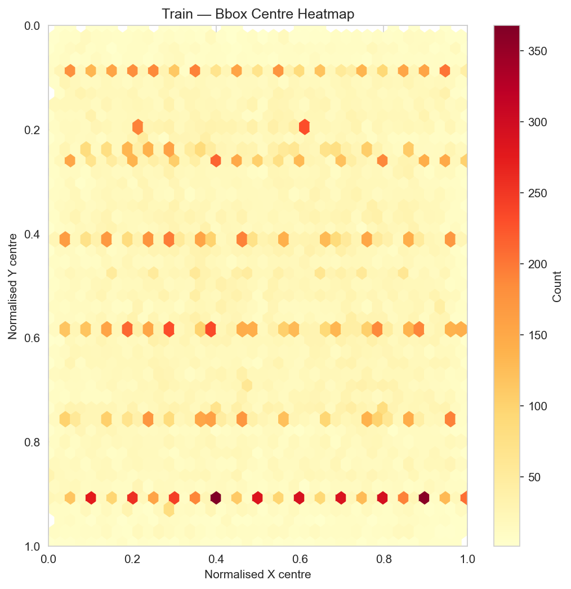 |

| Co-occurrence Matrix | Boxes Per Image | Image Sizes | Sample Grid |
|:-------------------:|:--------------:|:-----------:|:-----------:|
| 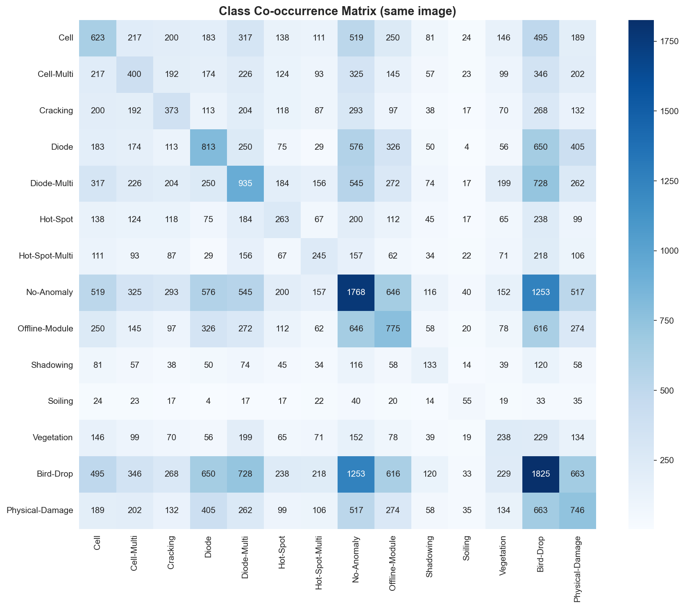 | 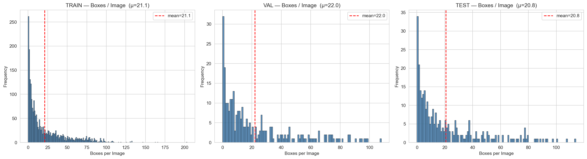 | 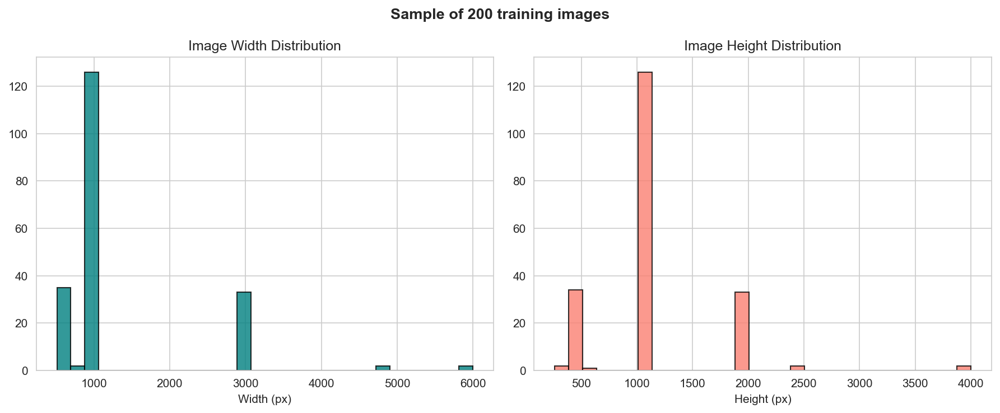 | 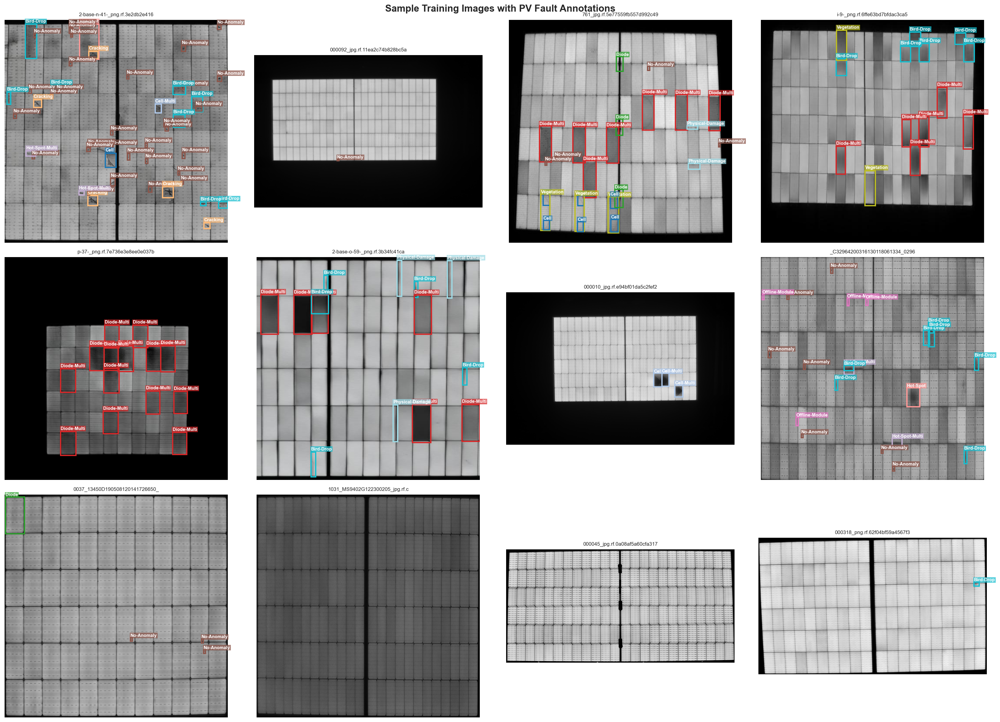 |

### Evaluation Visualizations

| Per-Class Performance | PR/F1 Analysis | Confusion Matrix |
|:--------------------:|:--------------:|:---------------:|
| 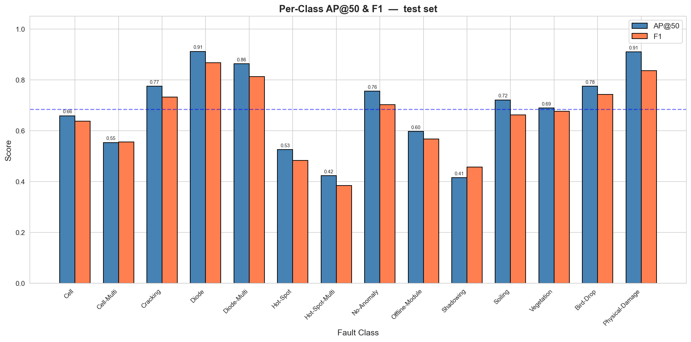 | 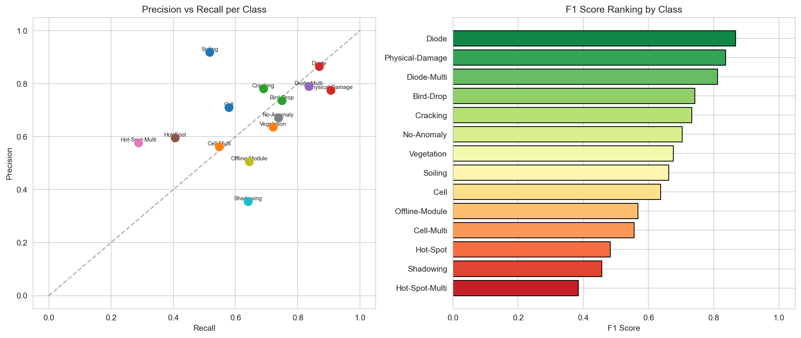 | 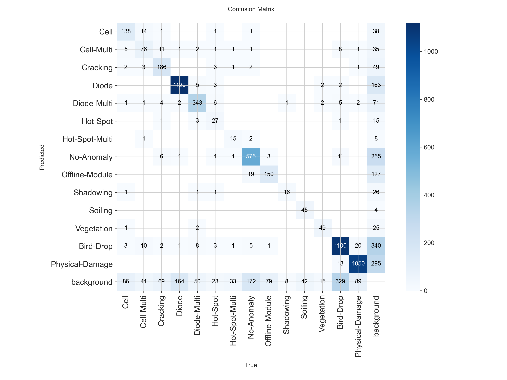 |

| Confusion Matrix (Normalized) | Example Prediction | Example Label |
|:-----------------------------:|:-----------------:|:-------------:|
| 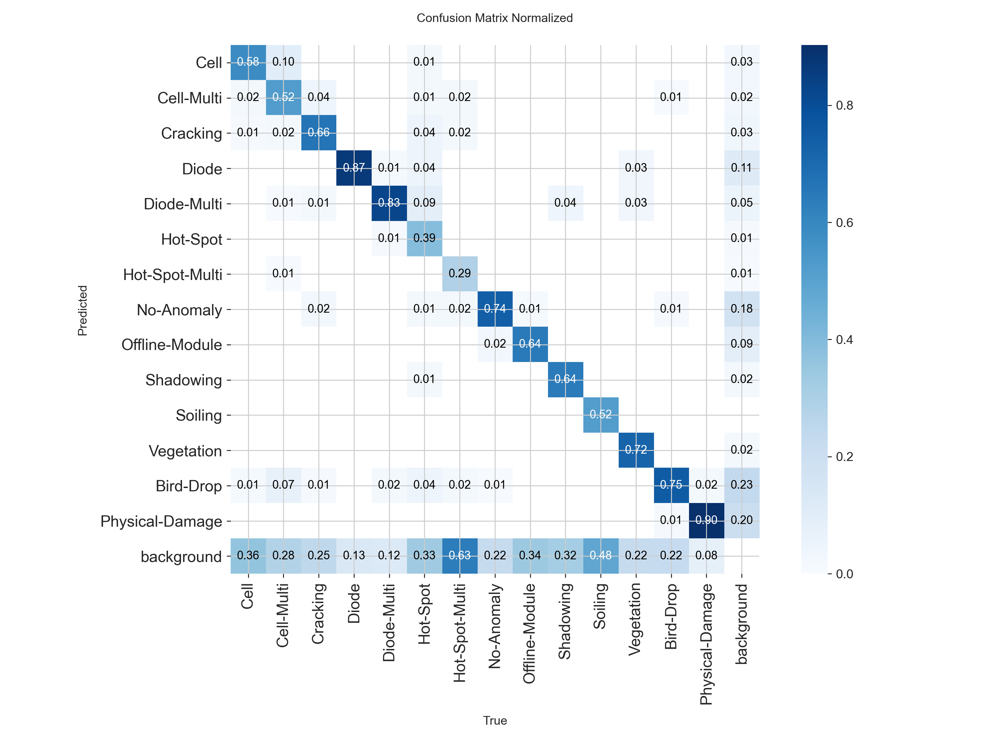 | 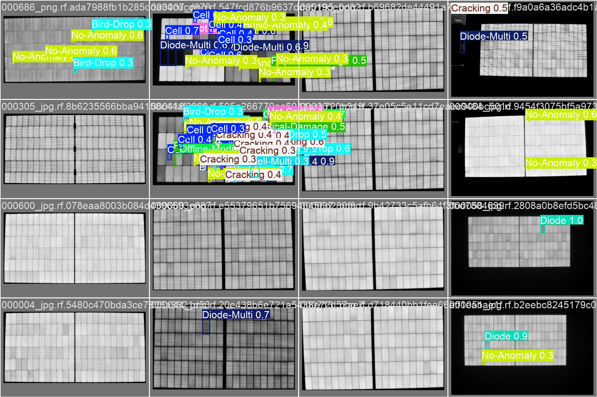 | 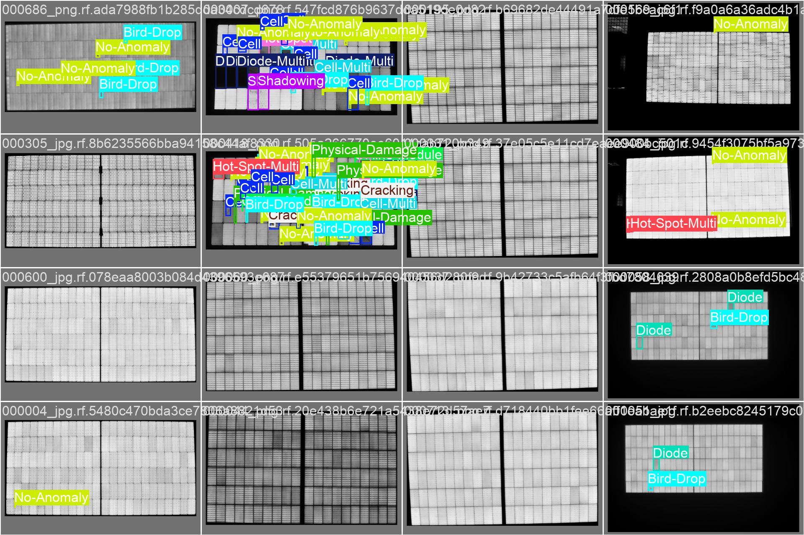 |
